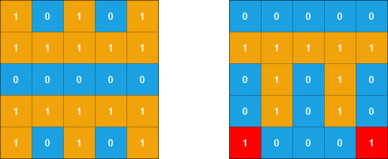

#### [1905. 统计子岛屿](https://leetcode-cn.com/problems/count-sub-islands/)

给你两个 m x n 的二进制矩阵 grid1 和 grid2 ，它们只包含 0 （表示水域）和 1 （表示陆地）。一个 岛屿 是由 四个方向 （水平或者竖直）上相邻的 1 组成的区域。任何矩阵以外的区域都视为水域。

如果 grid2 的一个岛屿，被 grid1 的一个岛屿 完全 包含，也就是说 grid2 中该岛屿的每一个格子都被 grid1 中同一个岛屿完全包含，那么我们称 grid2 中的这个岛屿为 子岛屿 。

请你返回 `grid2` 中 **子岛屿** 的 **数目** 。

**示例 1：**


```shell
输入：grid1 = [[1,1,1,0,0],[0,1,1,1,1],[0,0,0,0,0],[1,0,0,0,0],[1,1,0,1,1]], grid2 = [[1,1,1,0,0],[0,0,1,1,1],[0,1,0,0,0],[1,0,1,1,0],[0,1,0,1,0]]
输出：3
解释：如上图所示，左边为 grid1 ，右边为 grid2 。
grid2 中标红的 1 区域是子岛屿，总共有 3 个子岛屿。
```

**示例 2：**

    

```shell
输入：grid1 = [[1,0,1,0,1],[1,1,1,1,1],[0,0,0,0,0],[1,1,1,1,1],[1,0,1,0,1]], grid2 = [[0,0,0,0,0],[1,1,1,1,1],[0,1,0,1,0],[0,1,0,1,0],[1,0,0,0,1]]
输出：2 
解释：如上图所示，左边为 grid1 ，右边为 grid2 。
grid2 中标红的 1 区域是子岛屿，总共有 2 个子岛屿。
```

**提示：**

* m == grid1.length == grid2.length

* n == grid1[i].length == grid2[i].length

* 1 <= m, n <= 500

* grid1[i][j] 和 grid2[i][j] 都要么是 0 要么是 

### 题解

**深度优先搜索**

```java
class Solution {
 public int countSubIslands(int[][] grid1, int[][] grid2) {
        int m = grid1.length;
        int n = grid1[0].length;

        List<List<int[]>> lands = numIslands(grid2);
        int ans = 0;
        for (List<int[]> land : lands) {
            boolean flag = true;
            for (int[] arr : land) {
                if (grid1[arr[0]][arr[1]] == 0) {
                    flag = false;
                    break;
                }
            }
            if (flag) {
                ans += 1;
            }
        }
        return ans;
    }

    int[] dx = new int[]{1, 0, -1, 0};
    int[] dy = new int[]{0, 1, 0, -1};


    public List<List<int[]>> numIslands(int[][] grid) {
        List<List<int[]>> lands = new ArrayList<>();

        int n = grid.length;
        int m = grid[0].length;

        for (int i = 0; i < n; i++) {
            for (int j = 0; j < m; j++) {
                if (grid[i][j] == 1) {
                    List<int[]> list = new ArrayList<>();
                    dfs(grid, list, i, j);
                    lands.add(list);
                }
            }
        }
        return lands;
    }

    public void dfs(int[][] grid, List<int[]> list, int i, int j) {
        int n = grid.length;
        int m = grid[0].length;

        if (i < 0 || i >= n || j < 0 || j >= m || grid[i][j] == 0) {
            return;
        }

        list.add(new int[]{i, j});
        grid[i][j] = 0;
        for (int k = 0; k < 4; k++) {
            int x = i + dx[k];
            int y = j + dy[k];
            dfs(grid, list, x, y);
        }
    }
}
```
