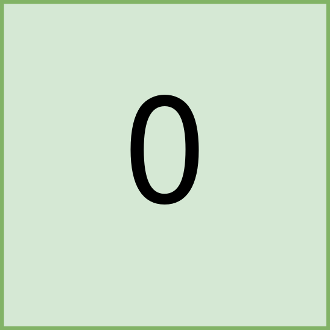

#### 1992. 找到所有的农场组

给你一个下标从 **0** 开始，大小为 `m x n` 的二进制矩阵 `land` ，其中 `0` 表示一单位的森林土地，`1` 表示一单位的农场土地。

为了让农场保持有序，农场土地之间以矩形的 农场组 的形式存在。每一个农场组都 仅 包含农场土地。且题目保证不会有两个农场组相邻，也就是说一个农场组中的任何一块土地都 不会 与另一个农场组的任何一块土地在四个方向上相邻。

land 可以用坐标系统表示，其中 land 左上角坐标为 (0, 0) ，右下角坐标为 (m-1, n-1) 。请你找到所有 农场组 最左上角和最右下角的坐标。一个左上角坐标为 (r1, c1) 且右下角坐标为 (r2, c2) 的 农场组 用长度为 4 的数组 [r1, c1, r2, c2] 表示。

请你返回一个二维数组，它包含若干个长度为 4 的子数组，每个子数组表示 land 中的一个 农场组 。如果没有任何农场组，请你返回一个空数组。可以以 任意顺序 返回所有农场组。

**示例 1：**


```shell
输入：land = [[1,0,0],[0,1,1],[0,1,1]]
输出：[[0,0,0,0],[1,1,2,2]]
解释：
第一个农场组的左上角为 land[0][0] ，右下角为 land[0][0] 。
第二个农场组的左上角为 land[1][1] ，右下角为 land[2][2] 。
```

**示例 2：**


```shell
输入：land = [[1,1],[1,1]]
输出：[[0,0,1,1]]
解释：
第一个农场组左上角为 land[0][0] ，右下角为 land[1][1] 。
```

**示例 3：**



```shell
输入：land = [[0]]
输出：[]
解释：
没有任何农场组。
```

**提示：**

* m == land.length
* n == land[i].length
* 1 <= m, n <= 300
* land 只包含 0 和 1 。
* 农场组都是 矩形 的形状。

### 题解

**深度优先搜索**

```java
class Solution {
    int[] dx = new int[]{1, 0, -1, 0};
    int[] dy = new int[]{0, 1, 0, -1};

    public int[][] findFarmland(int[][] land) {
        List<int[]> list = new ArrayList<>();
        int n = land.length;
        int m = land[0].length;

        for (int i = 0; i < n; i++) {
            for (int j = 0; j < m; j++) {
                if (land[i][j] == 1) {
                    int[] result = new int[]{i, j, i, j};
                    dfs(land, i, j, result);
                    list.add(result);
                }
            }
        }

        int[][] ans = new int[list.size()][4];
        for (int i = 0; i < list.size(); i++) {
            ans[i] = list.get(i);
        }
        return ans;
    }

    public void dfs(int[][] land, int i, int j, int[] result) {
        int n = land.length;
        int m = land[0].length;
        if (i < 0 || i >= n || j < 0 || j >= m || land[i][j] == 0) {
            return;
        }
        result[0] = Math.min(result[0], i);
        result[1] = Math.min(result[1], j);
        result[2] = Math.max(result[2], i);
        result[3] = Math.max(result[3], j);
        land[i][j] = 0;
        for (int k = 0; k < 4; k++) {
            int x = i + dx[k];
            int y = j + dy[k];
            dfs(land, x, y, result);
        }
    }
}
```

