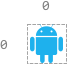

#### 2120. 执行所有后缀指令

现有一个 n x n 大小的网格，左上角单元格坐标 (0, 0) ，右下角单元格坐标 (n - 1, n - 1) 。给你整数 n 和一个整数数组 startPos ，其中 startPos = [startrow, startcol] 表示机器人最开始在坐标为 (startrow, startcol) 的单元格上。

另给你一个长度为 m 、下标从 0 开始的字符串 s ，其中 s[i] 是对机器人的第 i 条指令：'L'（向左移动），'R'（向右移动），'U'（向上移动）和 'D'（向下移动）。

机器人可以从 `s` 中的任一第 `i` 条指令开始执行。它将会逐条执行指令直到 `s` 的末尾，但在满足下述条件之一时，机器人将会停止：

- 下一条指令将会导致机器人移动到网格外。
- 没有指令可以执行。

返回一个长度为 `m` 的数组 `answer` ，其中 `answer[i]` 是机器人从第 `i` 条指令 **开始** ，可以执行的 **指令数目** 。

**示例 1：**


```shell
输入：n = 3, startPos = [0,1], s = "RRDDLU"
输出：[1,5,4,3,1,0]
解释：机器人从 startPos 出发，并从第 i 条指令开始执行：
- 0: "RRDDLU" 在移动到网格外之前，只能执行一条 "R" 指令。
- 1:  "RDDLU" 可以执行全部五条指令，机器人仍在网格内，最终到达 (0, 0) 。
- 2:   "DDLU" 可以执行全部四条指令，机器人仍在网格内，最终到达 (0, 0) 。
- 3:    "DLU" 可以执行全部三条指令，机器人仍在网格内，最终到达 (0, 0) 。
- 4:     "LU" 在移动到网格外之前，只能执行一条 "L" 指令。
- 5:      "U" 如果向上移动，将会移动到网格外。
```

**示例 2：**


```shell
输入：n = 2, startPos = [1,1], s = "LURD"
输出：[4,1,0,0]
解释：
- 0: "LURD"
- 1:  "URD"
- 2:   "RD"
- 3:    "D"
```

**示例 3：**



```shell
输入：n = 1, startPos = [0,0], s = "LRUD"
输出：[0,0,0,0]
解释：无论机器人从哪条指令开始执行，都会移动到网格外。
```

**提示：**

* m == s.length
* 1 <= n, m <= 500
* startPos.length == 2
* 0 <= startrow, startcol < n
* s 由 'L'、'R'、'U' 和 'D' 组成

### 题解

**深度优先搜索**

```java
class Solution {
    int[] dx = new int[]{0, 0, -1, 1};
    int[] dy = new int[]{-1, 1, 0, 0};

    public int[] executeInstructions(int n, int[] startPos, String s) {
        int length = s.length();
        int[] ans = new int[length];
        for (int i = 0; i < length; i++) {
            ans[i] = dfs(i, n, startPos, s);
        }
        return ans;
    }

    public int dfs(int index, int n, int[] startPos, String s) {
        if (index >= s.length()) {
            return 0;
        }
        int x = startPos[0];
        int y = startPos[1];


        char ch = s.charAt(index);
        int direction = 0;
        switch (ch) {
            case 'L':
                direction = 0;
                break;
            case 'R':
                direction = 1;
                break;
            case 'U':
                direction = 2;
                break;
            case 'D':
                direction = 3;
                break;
        }

        int nextX = x + dx[direction];
        int nextY = y + dy[direction];

        if (nextX < 0 || nextX >= n || nextY < 0 || nextY >= n) {
            return 0;
        }

        int ans = 1;
        return ans + dfs(index + 1, n, new int[]{nextX, nextY}, s);
    }
}
```

