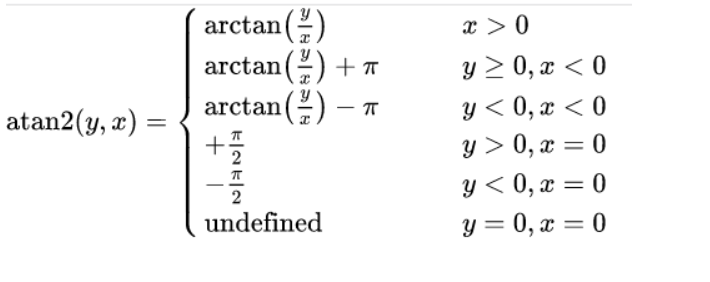
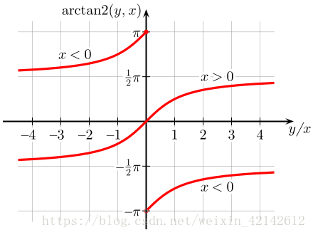

#### 1610. 可见点的最大数目

给你一个点数组 points 和一个表示角度的整数 angle ，你的位置是 location ，其中 location = [posx, posy] 且 points[i] = [xi, yi] 都表示 X-Y 平面上的整数坐标。

最开始，你面向东方进行观测。你 不能 进行移动改变位置，但可以通过 自转 调整观测角度。换句话说，posx 和 posy 不能改变。你的视野范围的角度用 angle 表示， 这决定了你观测任意方向时可以多宽。设 d 为你逆时针自转旋转的度数，那么你的视野就是角度范围 [d - angle/2, d + angle/2] 所指示的那片区域。

对于每个点，如果由该点、你的位置以及从你的位置直接向东的方向形成的角度 **位于你的视野中** ，那么你就可以看到它。

同一个坐标上可以有多个点。你所在的位置也可能存在一些点，但不管你的怎么旋转，总是可以看到这些点。同时，点不会阻碍你看到其他点。

返回你能看到的点的最大数目。

**示例 1：**


```shell
输入：points = [[2,1],[2,2],[3,3]], angle = 90, location = [1,1]
输出：3
解释：阴影区域代表你的视野。在你的视野中，所有的点都清晰可见，尽管 [2,2] 和 [3,3]在同一条直线上，你仍然可以看到 [3,3] 。
```

**示例 2：**

```shell
输入：points = [[2,1],[2,2],[3,4],[1,1]], angle = 90, location = [1,1]
输出：4
解释：在你的视野中，所有的点都清晰可见，包括你所在位置的那个点。
```

**示例 3：**


```shell
输入：points = [[1,0],[2,1]], angle = 13, location = [1,1]
输出：1
解释：如图所示，你只能看到两点之一。
```

**提示：**

* 1 <= points.length <= 105
* points[i].length == 2
* location.length == 2
* 0 <= angle < 360
* 0 <= posx, posy, xi, yi <= 100

### 题解

### 计算角度排序+双指针实现滑动窗口

#### `tan2`函数

`atan2`函数，通过坐标（x,y）计算角度。具体公式，



为了更加直观，其函数图形为



因此，我们可以看到，下到上依次是3,4,1,2象限。（不做转换也不会有影响）
通过对theta<0 的进行+2*PI的操作，可以转换成 1,2,3,4象限。
（相当于排序后的起始位从第1象限开始）

#### 思想

```shell
1. 所有坐标转化为角度存入list中（因为是一个○的关系，因此为了让首尾相连，进行一次+2*PI的操作）
2. 排序
3. 双指针实现滑动窗口，记录最大值
4. 注意对与观测位置重合的节点进行特殊处理。（在1时）
```

```java
class Solution {
    public int visiblePoints(List<List<Integer>> points, int angle, List<Integer> location) {
        double PRECISION = 1e-8;
        List<Double> angles = new ArrayList<>();
        int same = 0;
        int locationx = location.get(0);
        int locationy = location.get(1);

        for (List<Integer> point : points) {
            int pointx = point.get(0);
            int pointy = point.get(1);
            if (pointx == locationx && pointy == locationy) {
                same++;
                continue;
            }
            angles.add(getAngle(pointx, pointy, locationx, locationy));
        }

        Collections.sort(angles);

        int length = angles.size();
        for (int i = 0; i < length; i++) {
            angles.add(angles.get(i) + 360d);
        }

        int right = 0;
        int max = 0;
        int size = angles.size();
        for (int left = 0; left < size; left++) {
            while ((right + 1) < size && (angles.get(right + 1) - angles.get(left) <= ((double) angle + PRECISION))) {
                right++;
            }
            max = Math.max(max, right - left + 1);
        }
        return max + same;
    }

    // 计算point所在点和location所在点的连线与水平线之间的夹角
    public double getAngle(int pointx, int pointy, int locationx, int locationy) {
        // 直接算出度数,atan2的值域(-π,π]
        double angle = Math.toDegrees(Math.atan2(pointy - locationy, pointx - locationx));
        // 都转换到[0,2π)
        if (angle < 0) {
            angle += 360d;
        }
        return angle;
    }
}
```

