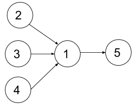

#### 1494. 并行课程 II

给你一个整数 n 表示某所大学里课程的数目，编号为 1 到 n ，数组 dependencies 中， dependencies[i] = [xi, yi]  表示一个先修课的关系，也就是课程 xi 必须在课程 yi 之前上。同时你还有一个整数 k 。

在一个学期中，你 **最多** 可以同时上 `k` 门课，前提是这些课的先修课在之前的学期里已经上过了。

请你返回上完所有课最少需要多少个学期。题目保证一定存在一种上完所有课的方式。

**示例 1：**


```shell
输入：n = 4, dependencies = [[2,1],[3,1],[1,4]], k = 2
输出：3 
解释：上图展示了题目输入的图。在第一个学期中，我们可以上课程 2 和课程 3 。然后第二个学期上课程 1 ，第三个学期上课程 4 。
```

**示例 2：**



```shell
输入：n = 5, dependencies = [[2,1],[3,1],[4,1],[1,5]], k = 2
输出：4 
解释：上图展示了题目输入的图。一个最优方案是：第一学期上课程 2 和 3，第二学期上课程 4 ，第三学期上课程 1 ，第四学期上课程 5 。
```

**示例 3：**

```shell
输入：n = 11, dependencies = [], k = 2
输出：6
```

**提示：**

* 1 <= n <= 15
* 1 <= k <= n
* 0 <= dependencies.length <= n * (n-1) / 2
* dependencies[i].length == 2
* 1 <= xi, yi <= n
* xi != yi
* 所有先修关系都是不同的，也就是说 dependencies[i] != dependencies[j] 。
* 题目输入的图是个有向无环图。

### 题解

**状态压缩+动态规划**

```java
class Solution {

    public int minNumberOfSemesters(int n, int[][] relations, int k) {
        // 前置课程 二进制状态压缩
        int[] pre = new int[n];
        for (int[] relation : relations) {
            pre[relation[1] - 1] |= 1 << relation[0] - 1;
        }

        // dp[mask]表示修完mask中所有课程的最小学期数
        int max = 1 << n;
        int[] dp = new int[max];
        // 题目保证能全部修完，初始化最大值n即可
        Arrays.fill(dp, n);
        // 假设为4门课程，初始0门课需要0学期 dp[0000] = 0，最终目标是求 dp[1111]
        dp[0] = 0;
        // 枚举当前状态
        for (int mask = 0; mask < max; mask++) {
            // 当前状态下未学过的可学习的课程
            int canStudy = 0;
            for (int i = 0; i < n; i++) {
                // 当前第i+1课程已学过
                // 此处注意,不能使用 ==1 判断,会超时
                if ((mask & (1 << i)) !=0) {
                    continue;
                }

                // 当前状态已经学习过第i+1门课程的所有前置课程
                if ((mask & pre[i]) == pre[i]) {
                    canStudy |= 1 << i;
                }
            }

            // 遍历canStudy的所有子集,若1的个数超过k,则不用学习(不用消耗1学期的时间)
            // 若1的个数小于等于k,则可以消耗1学期的时间,将状态从mask转移到mask|(canStudy的该子集)
            // 根据此转移策略,可以实现dp的状态转移
            for (int study = canStudy; study > 0; study = (study - 1) & canStudy) {
                if (Integer.bitCount(study) > k) {
                    continue;
                }
                dp[mask | study] = Math.min(dp[mask | study], dp[mask] + 1);
            }
        }
        return dp[max - 1];
    }
}
```

