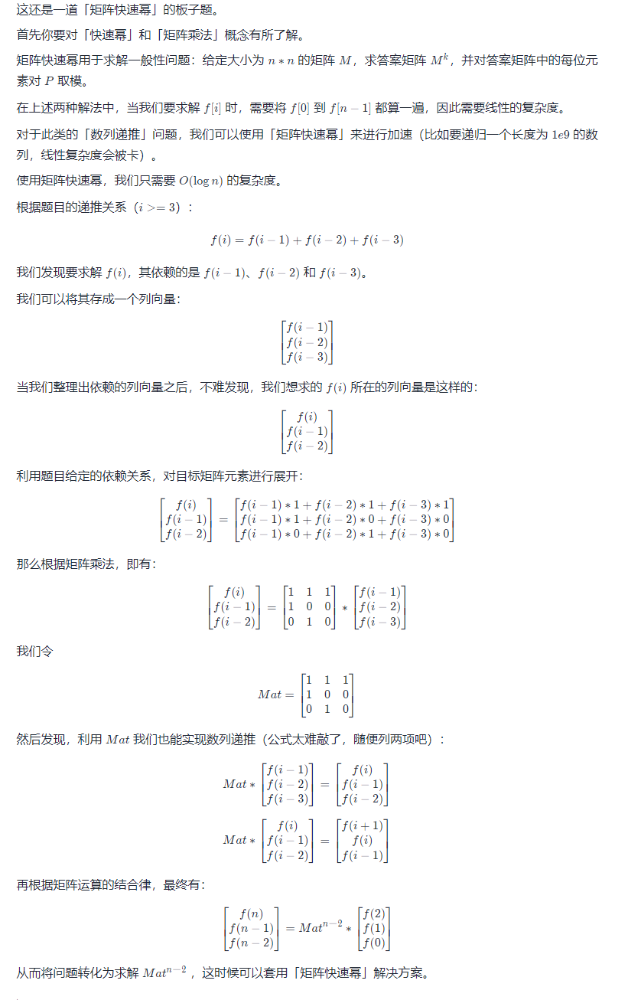

#### 1137. 第 N 个泰波那契数

泰波那契序列 Tn 定义如下： 

T0 = 0, T1 = 1, T2 = 1, 且在 n >= 0 的条件下 Tn+3 = Tn + Tn+1 + Tn+2

给你整数 n，请返回第 n 个泰波那契数 Tn 的值。

**示例 1：**

```shell
输入：n = 4
输出：4
解释：
T_3 = 0 + 1 + 1 = 2
T_4 = 1 + 1 + 2 = 4
```

**示例 2：**

```shell
输入：n = 25
输出：1389537
```

**提示：**

- `0 <= n <= 37`
- 答案保证是一个 32 位整数，即 `answer <= 2^31 - 1`。

### 题解

## 迭代实现动态规划

都直接给出状态转移方程了，其实就是道模拟题。

使用三个变量，从前往后算一遍即可。

```java
class Solution {
    public int tribonacci(int n) {
        if (n == 0) return 0;
        if (n == 1 || n == 2) return 1;
        int a = 0, b = 1, c = 1;
        for (int i = 3; i <= n; i++) {
            int d = a + b + c;
            a = b;
            b = c;
            c = d;
        }
        return c;
    }
}
```

- 时间复杂度：O(n)
- 空间复杂度：O(1)

## 递归实现动态规划

也就是记忆化搜索，创建一个 `cache` 数组用于防止重复计算。

```java
class Solution {
    int[] cache = new int[40];
    public int tribonacci(int n) {
        if (n == 0) return 0;
        if (n == 1 || n == 2) return 1;
        if (cache[n] != 0) return cache[n];
        cache[n] = tribonacci(n - 1) + tribonacci(n - 2) + tribonacci(n - 3); 
        return cache[n];
    }
}
```

- 时间复杂度：O(n)
- 空间复杂度：O(n)

## 矩阵快速幂



```java
class Solution {
    int N = 3;
    int[][] mul(int[][] a, int[][] b) {
        int[][] c = new int[N][N];
        for (int i = 0; i < N; i++) {
            for (int j = 0; j < N; j++) {
                c[i][j] = a[i][0] * b[0][j] + a[i][1] * b[1][j] + a[i][2] * b[2][j];
            }
        }
        return c;
    }
    public int tribonacci(int n) {
        if (n == 0) return 0;
        if (n == 1 || n == 2) return 1;
        int[][] ans = new int[][]{
            {1,0,0},
            {0,1,0},
            {0,0,1}
        };
        int[][] mat = new int[][]{
            {1,1,1},
            {1,0,0},
            {0,1,0}
        };
        int k = n - 2;
        while (k != 0) {
            if ((k & 1) != 0) ans = mul(ans, mat);
            mat = mul(mat, mat);
            k >>= 1;
        }
        return ans[0][0] + ans[0][1];
    }
}
```

- 时间复杂度：O*(log*n)
- 空间复杂度：O(1)

## 打表

当然，我们也可以将数据范围内的所有答案进行打表预处理，然后在询问时直接查表返回。

但对这种题目进行打表带来的收益没有平常打表题的大，因为打表内容不是作为算法必须的一个环节，而直接是作为该询问的答案，但测试样例是不会相同的，即不会有两个测试数据都是 n = 37n=37。

这时候打表节省的计算量是不同测试数据之间的相同前缀计算量，例如 n = 36n=36 和 n = 37n=37，其 3535 之前的计算量只会被计算一次。

因此直接为「解法二」的 cache 添加 static 修饰其实是更好的方式：代码更短，同时也能起到同样的节省运算量的效果。

```java
class Solution {
    static int[] cache = new int[40];
    static {
        cache[0] = 0;
        cache[1] = 1;
        cache[2] = 1;
        for (int i = 3; i < cache.length; i++) {
            cache[i] = cache[i - 1] + cache[i - 2] + cache[i - 3];
        }
    }
    public int tribonacci(int n) {
        return cache[n];
    }
}
```

