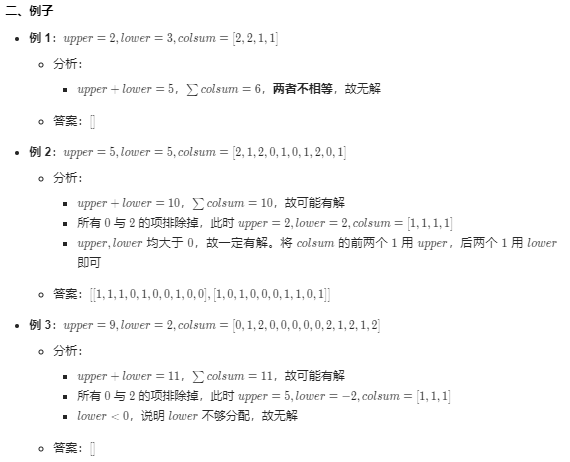

#### 1253. 重构 2 行二进制矩阵

给你一个 `2` 行 `n` 列的二进制数组：

* 矩阵是一个二进制矩阵，这意味着矩阵中的每个元素不是 0 就是 1。
* 第 0 行的元素之和为 upper。
* 第 1 行的元素之和为 lower。
* 第 i 列（从 0 开始编号）的元素之和为 colsum[i]，colsum 是一个长度为 n 的整数数组。

你需要利用 `upper`，`lower` 和 `colsum` 来重构这个矩阵，并以二维整数数组的形式返回它。

如果有多个不同的答案，那么任意一个都可以通过本题。

如果不存在符合要求的答案，就请返回一个空的二维数组。

**示例 1：**

```shell
输入：upper = 2, lower = 1, colsum = [1,1,1]
输出：[[1,1,0],[0,0,1]]
解释：[[1,0,1],[0,1,0]] 和 [[0,1,1],[1,0,0]] 也是正确答案。
```

**示例 2：**

```shell
输入：upper = 2, lower = 3, colsum = [2,2,1,1]
输出：[]
```

**示例 3：**

```shell
输入：upper = 5, lower = 5, colsum = [2,1,2,0,1,0,1,2,0,1]
输出：[[1,1,1,0,1,0,0,1,0,0],[1,0,1,0,0,0,1,1,0,1]]
```

**提示：**

* 1 <= colsum.length <= 10^5
* 0 <= upper, lower <= colsum.length
* 0 <= colsum[i] <= 2


### 题解



```java

//leetcode submit region begin(Prohibit modification and deletion)
class Solution {
    public List<List<Integer>> reconstructMatrix(int upper, int lower, int[] colsum) {
        int sum = 0;
        int len = colsum.length;
        List<List<Integer>> list = new ArrayList<>();

        for (int i = 0; i < len; i++) {
            sum += colsum[i];
        }

        if (upper + lower != sum) {
            return list;
        }

        List<Integer> upList = new ArrayList<>();
        List<Integer> loList = new ArrayList<>();

        for (int i = 0; i < len; i++) {
            if (colsum[i] == 2) {
                upList.add(1);
                loList.add(1);
                upper--;
                lower--;
            } else if (colsum[i] == 0) {
                upList.add(0);
                loList.add(0);
            } else if (colsum[i] == 1) {
                if (upper > lower) {
                    upList.add(1);
                    loList.add(0);
                    upper--;
                } else if (upper <= lower) {
                    upList.add(0);
                    loList.add(1);
                    lower--;
                }
            }
        }

        if (upper < 0 || lower < 0) {
            return list;
        }
        list.add(upList);
        list.add(loList);
        return list;
    }
}
//leetcode submit region end(Prohibit modification and deletion)

```