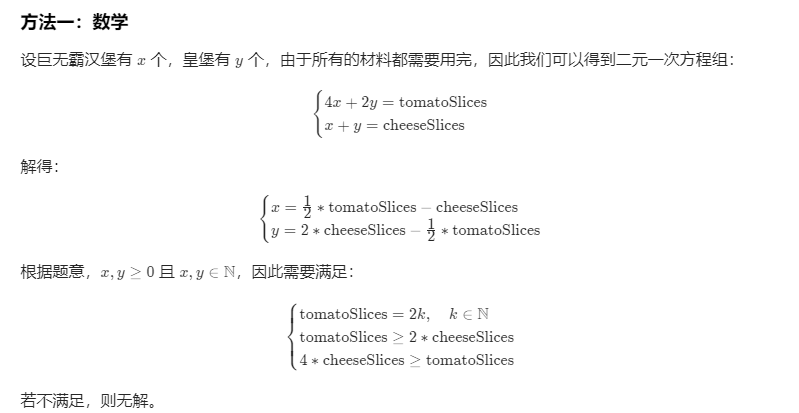

#### 1276. 不浪费原料的汉堡制作方案

圣诞活动预热开始啦，汉堡店推出了全新的汉堡套餐。为了避免浪费原料，请你帮他们制定合适的制作计划。

给你两个整数 `tomatoSlices` 和 `cheeseSlices`，分别表示番茄片和奶酪片的数目。不同汉堡的原料搭配如下：

- **巨无霸汉堡：**4 片番茄和 1 片奶酪
- **小皇堡：**2 片番茄和 1 片奶酪

请你以 [total_jumbo, total_small]（[巨无霸汉堡总数，小皇堡总数]）的格式返回恰当的制作方案，使得剩下的番茄片 tomatoSlices 和奶酪片 cheeseSlices 的数量都是 0。

如果无法使剩下的番茄片 `tomatoSlices` 和奶酪片 `cheeseSlices` 的数量为 `0`，就请返回 `[]`。

**示例 1：**

```shell
输入：tomatoSlices = 16, cheeseSlices = 7
输出：[1,6]
解释：制作 1 个巨无霸汉堡和 6 个小皇堡需要 4*1 + 2*6 = 16 片番茄和 1 + 6 = 7 片奶酪。不会剩下原料。
```

**示例 2：**

```shell
输入：tomatoSlices = 17, cheeseSlices = 4
输出：[]
解释：只制作小皇堡和巨无霸汉堡无法用光全部原料。
```

**示例 3：**

```shell
输入：tomatoSlices = 4, cheeseSlices = 17
输出：[]
解释：制作 1 个巨无霸汉堡会剩下 16 片奶酪，制作 2 个小皇堡会剩下 15 片奶酪。
```

**示例 4：**

```shell
输入：tomatoSlices = 0, cheeseSlices = 0
输出：[0,0]
```

**示例 5：**

```shell
输入：tomatoSlices = 2, cheeseSlices = 1
输出：[0,1]
```

**提示：**

- `0 <= tomatoSlices <= 10^7`
- `0 <= cheeseSlices <= 10^7`

### 方法一：数学

设巨无霸汉堡有 x 个，皇堡有 y个，由于所有的材料都需要用完，因此我们可以得到二元一次方程组：



```java
//leetcode submit region begin(Prohibit modification and deletion)
class Solution {
    public List<Integer> numOfBurgers(int tomatoSlices, int cheeseSlices) {
        List<Integer> list = new ArrayList<>();
        if (tomatoSlices % 2 != 0 || tomatoSlices < cheeseSlices * 2 || cheeseSlices * 4 < tomatoSlices) {
            return list;
        }
        list.add(tomatoSlices / 2 - cheeseSlices);
        list.add(cheeseSlices * 2 - tomatoSlices / 2);
        return list;
    }

}
//leetcode submit region end(Prohibit modification and deletion)

```

