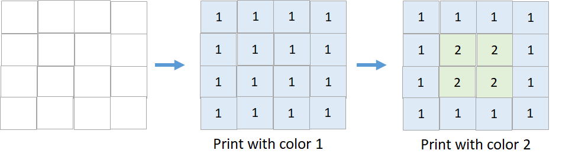
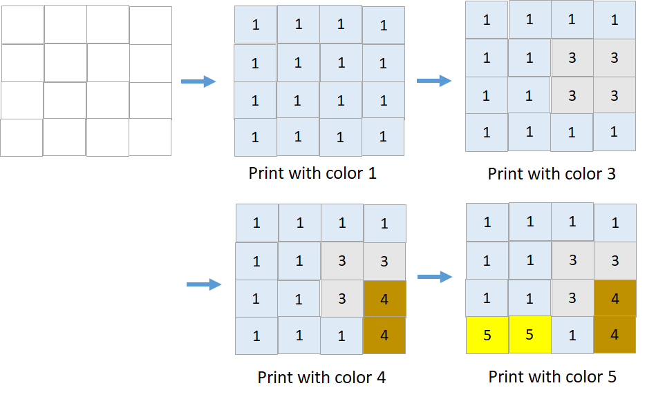

#### 1591. 奇怪的打印机 II

给你一个奇怪的打印机，它有如下两个特殊的打印规则：

- 每一次操作时，打印机会用同一种颜色打印一个矩形的形状，每次打印会覆盖矩形对应格子里原本的颜色。

- 一旦矩形根据上面的规则使用了一种颜色，那么 **相同的颜色不能再被使用** 。

给你一个初始没有颜色的 `m x n` 的矩形 `targetGrid` ，其中 `targetGrid[row][col]` 是位置 `(row, col)` 的颜色。

如果你能按照上述规则打印出矩形 `targetGrid` ，请你返回 `true` ，否则返回 `false` 。

**示例 1：**



```shell
输入：targetGrid = [[1,1,1,1],[1,2,2,1],[1,2,2,1],[1,1,1,1]]
输出：true
```

**示例 2：**



```shell
输入：targetGrid = [[1,1,1,1],[1,1,3,3],[1,1,3,4],[5,5,1,4]]
输出：true
```

**示例 3：**

```shell
输入：targetGrid = [[1,2,1],[2,1,2],[1,2,1]]
输出：false
解释：没有办法得到 targetGrid ，因为每一轮操作使用的颜色互不相同。
```

**示例 4：**

```shell
输入：targetGrid = [[1,1,1],[3,1,3]]
输出：false
```

**提示：**

* m == targetGrid.length
* n == targetGrid[i].length
* 1 <= m, n <= 60
* 1 <= targetGrid [row] [col] <= 60


### 题解

- 对于每一个targetGrid中的值val，记录下该值出现的最左最右最上最下边界。

- 对于每一个val，如果它的上下左右边界组成的矩形内要么是val，要么是0，那么就将其中的所有元素修改为0。

- 如果对于所有的val，都不存在这样一个可行的矩形，则打印失败。

- 如果最终结果是全零矩阵，则打印成功。

```java
class Solution {
    public boolean isPrintable(int[][] targetGrid) {
        int[] values=new int[61];
        int[] min_i=new int[61]; Arrays.fill(min_i, 61);
        int[] max_i=new int[61]; Arrays.fill(max_i, -1);
        int[] min_j=new int[61]; Arrays.fill(min_j, 61);
        int[] max_j=new int[61]; Arrays.fill(max_j, -1);
        int n=targetGrid.length, m=targetGrid[0].length;
        Set<Integer> set=new HashSet<>();
        for(int i=0; i<n; i++){
            for(int j=0; j<m; j++){
                int val=targetGrid[i][j];
                set.add(val);
                min_i[val]=Math.min(min_i[val], i);
                max_i[val]=Math.max(max_i[val], i);
                min_j[val]=Math.min(min_j[val], j);
                max_j[val]=Math.max(max_j[val], j);
            }
        }
        while(!allZero(targetGrid)){
            int value=-1;
            for(int val:set){
                if(allValid(min_i[val], min_j[val], max_i[val], max_j[val], val, targetGrid)){
                    beZero(min_i[val], min_j[val], max_i[val], max_j[val], targetGrid);
                    value=val;
                    break;
                }
            }
            if(value!=-1) set.remove(value);
            else return false;
        }
        return true;
    }
    boolean allValid(int i1, int j1, int i2, int j2, int val, int[][] targetGrid){
        for(int i=i1; i<=i2; i++){
            for(int j=j1; j<=j2; j++){
                if(targetGrid[i][j]!=val&&targetGrid[i][j]!=0)
                    return false;
            }
        }
        return true;
    }
    boolean allZero(int[][] targetGrid){
        for(int i=0; i<targetGrid.length; i++){
            for(int j=0; j<targetGrid[0].length; j++){
                if(targetGrid[i][j]!=0)
                    return false;
            }
        }
        return true;
    }
    void beZero(int i1, int j1, int i2, int j2, int[][] targetGrid){
        for(int i=i1; i<=i2; i++){
            for(int j=j1; j<=j2; j++){
                targetGrid[i][j]=0;
            }
        }
    }
}
```

