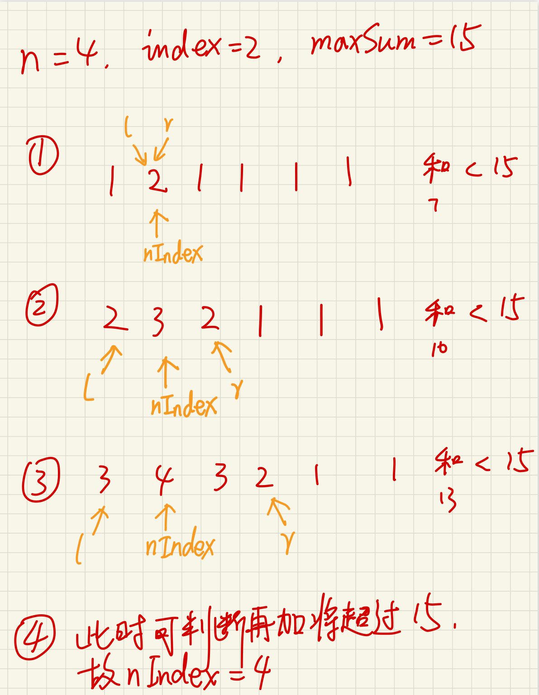

#### 1802. 有界数组中指定下标处的最大值

给你三个正整数 `n`、`index` 和 `maxSum` 。你需要构造一个同时满足下述所有条件的数组 `nums`（下标 **从 0 开始** 计数）：

* nums.length == n
* nums[i] 是 正整数 ，其中 0 <= i < n
* abs(nums[i] - nums[i+1]) <= 1 ，其中 0 <= i < n-1
* nums 中所有元素之和不超过 maxSum
* nums[index] 的值被 最大化

返回你所构造的数组中的 `nums[index]` 。

注意：`abs(x)` 等于 `x` 的前提是 `x >= 0` ；否则，`abs(x)` 等于 `-x` 。

**示例 1：**

```shell
输入：n = 4, index = 2,  maxSum = 6
输出：2
解释：数组 [1,1,2,1] 和 [1,2,2,1] 满足所有条件。不存在其他在指定下标处具有更大值的有效数组。
```

**示例 2：**

```shell
输入：n = 6, index = 1,  maxSum = 10
输出：3
```

**提示：**

- `1 <= n <= maxSum <= 109`
- `0 <= index < n`

### 题解

1. 定义nIndex为所求最大值，首先将nIndex初始化为1
2. 然后定义两个指针l、r指向nIndex位置，两个指针分别往两边走
3. 将l、r指向的区域都加1，nIndex也加1
4. 当某一指针走到尽头以后，另一指针接着走，重复3
5. 当两个指针都走到尽头以后，所有数都同时+1，直到和大于maxSum。（中途需要一直判断和与maxSum的大小，如果超过了maxSum，则停止后面的操作，返回nIndex的值）



```java
public int maxValue(int n, int index, int maxSum) {
    int l = index, r = index;
    int ans = 1;
    // 整个数组一开始全部填充为1，
    // rest记录先全部填充1后，剩下1的个数
    int rest = maxSum - n;
    while (l > 0 || r < n - 1) {
        int len = r - l + 1;
        if (rest >= len) {
            // 当前[l,r]范围全部+1
            rest -= len;
            ans++;
            // 往左右两边扩
            l = Math.max(0, l - 1);
            r = Math.min(n - 1, r + 1);
        } else {
            break;
        }
    }
    // 扩大到整个数组之后，剩余的值“雨露均沾”一下
    ans += rest / n;
    return ans;
}
```

