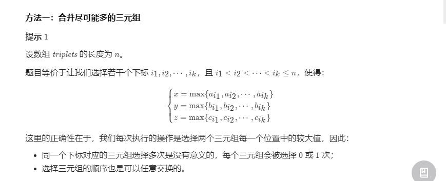
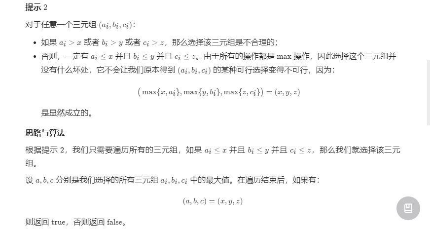

#### 1899. 合并若干三元组以形成目标三元组

三元组 是一个由三个整数组成的数组。给你一个二维整数数组 triplets ，其中 triplets[i] = [ai, bi, ci] 表示第 i 个 三元组 。同时，给你一个整数数组 target = [x, y, z] ，表示你想要得到的 三元组 。

为了得到 `target` ，你需要对 `triplets` 执行下面的操作 **任意次**（可能 **零** 次）：

* 选出两个下标（下标 从 0 开始 计数）i 和 j（i != j），并 更新 triplets[j] 为 [max(ai, aj), max(bi, bj), max(ci, cj)] 。
  * 例如，triplets[i] = [2, 5, 3] 且 triplets[j] = [1, 7, 5]，triplets[j] 将会更新为 [max(2, 1), max(5, 7), max(3, 5)] = [2, 7, 5] 。

如果通过以上操作我们可以使得目标 **三元组** `target` 成为 `triplets` 的一个 **元素** ，则返回 `true` ；否则，返回 `false` 。

**示例 1：**

```shell
输入：triplets = [[2,5,3],[1,8,4],[1,7,5]], target = [2,7,5]
输出：true
解释：执行下述操作：
- 选择第一个和最后一个三元组 [[2,5,3],[1,8,4],[1,7,5]] 。更新最后一个三元组为 [max(2,1), max(5,7), max(3,5)] = [2,7,5] 。triplets = [[2,5,3],[1,8,4],[2,7,5]]
目标三元组 [2,7,5] 现在是 triplets 的一个元素。
```

**示例 2：**

```shell
输入：triplets = [[1,3,4],[2,5,8]], target = [2,5,8]
输出：true
解释：目标三元组 [2,5,8] 已经是 triplets 的一个元素。
```

**示例 3：**

```shell
输入：triplets = [[2,5,3],[2,3,4],[1,2,5],[5,2,3]], target = [5,5,5]
输出：true
解释：执行下述操作：
- 选择第一个和第三个三元组 [[2,5,3],[2,3,4],[1,2,5],[5,2,3]] 。更新第三个三元组为 [max(2,1), max(5,2), max(3,5)] = [2,5,5] 。triplets = [[2,5,3],[2,3,4],[2,5,5],[5,2,3]] 。
- 选择第三个和第四个三元组 [[2,5,3],[2,3,4],[2,5,5],[5,2,3]] 。更新第四个三元组为 [max(2,5), max(5,2), max(5,3)] = [5,5,5] 。triplets = [[2,5,3],[2,3,4],[2,5,5],[5,5,5]] 。
目标三元组 [5,5,5] 现在是 triplets 的一个元素。
```

**示例 4：**

```shell
输入：triplets = [[3,4,5],[4,5,6]], target = [3,2,5]
输出：false
解释：无法得到 [3,2,5] ，因为 triplets 不含 2 。
```

**提示：**

* 1 <= triplets.length <= 105
* triplets[i].length == target.length == 3
* 1 <= ai, bi, ci, x, y, z <= 1000

### 题解





```java
//leetcode submit region begin(Prohibit modification and deletion)
class Solution {
    public boolean mergeTriplets(int[][] triplets, int[] target) {
        int x = target[0];
        int y = target[1];
        int z = target[2];

        int a = 0;
        int b = 0;
        int c = 0;
        for (int[] triplet : triplets) {
            int ai = triplet[0];
            int bi = triplet[1];
            int ci = triplet[2];
            if (ai <= x && bi <= y && ci <= z) {
                a = Math.max(a, ai);
                b = Math.max(b, bi);
                c = Math.max(c, ci);
            }
        }
        return a == x && b == y && c == z;
    }
}
//leetcode submit region end(Prohibit modification and deletion)

```

