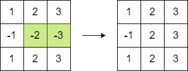

#### 1975. 最大方阵和

给你一个 `n x n` 的整数方阵 `matrix` 。你可以执行以下操作 **任意次** ：

* 选择 `matrix` 中 **相邻** 两个元素，并将它们都 **乘以** `-1` 。

如果两个元素有 **公共边** ，那么它们就是 **相邻** 的。

你的目的是 **最大化** 方阵元素的和。请你在执行以上操作之后，返回方阵的 **最大** 和。

**示例 1：**


```shell
输入：matrix = [[1,-1],[-1,1]]
输出：4
解释：我们可以执行以下操作使和等于 4 ：
- 将第一行的 2 个元素乘以 -1 。
- 将第一列的 2 个元素乘以 -1 。
```

**示例 2：**



```shell
输入：matrix = [[1,2,3],[-1,-2,-3],[1,2,3]]
输出：16
解释：我们可以执行以下操作使和等于 16 ：
- 将第二行的最后 2 个元素乘以 -1 。
```

**提示：**

* n == matrix.length == matrix[i].length
* 2 <= n <= 250
* `-105 <= matrix[i][j] <= 105`

### 题解

**贪心**

```java
class Solution {
    public long maxMatrixSum(int[][] matrix) {
        long ans = 0;
        int count = 0;
        int min = Integer.MAX_VALUE;
        int n = matrix.length;


        for (int i = 0; i < n; i++) {
            for (int j = 0; j < n; j++) {
                if (matrix[i][j] <= 0) {
                    count++;
                }
                if (Math.abs(matrix[i][j]) < min) {
                    min = Math.abs(matrix[i][j]);
                }

                ans += Math.abs(matrix[i][j]);
            }
        }

        if (count != 0 && (count & 1) == 0) {
            return ans;
        }

        if (count != 0 && (count & 1) == 1) {
            ans -= 2 * min;
        }
        return ans;
    }
}
```

